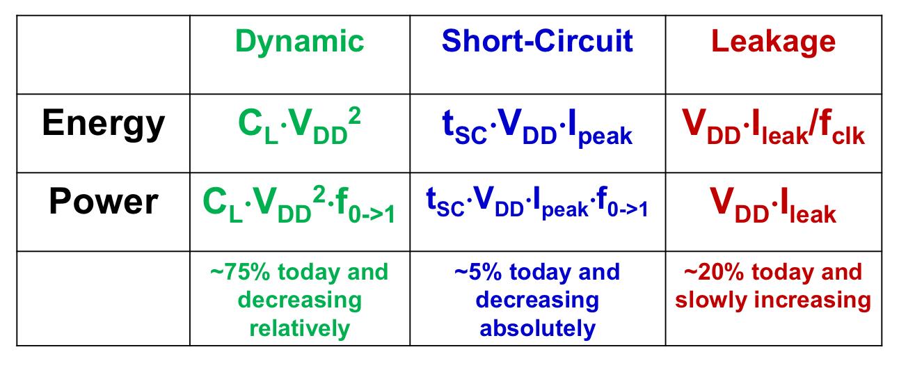

## Dynamic Power
##### Dynamic Energy Dissipation

$$
\begin{align}
E=\int^\infty_{t=0}V_{DD}\cdot I_{Dp}\cdot \mathrm dt\\
I_{Dp}=C_L\cdot \frac{\mathrm dV}{\mathrm dt}
\end{align}
$$
$$
E=C_L\cdot V^2_{DD}
$$
Dynamic energy is not a function of ==transistor size==.
$C_L$ is not only relevant for speed, but also energy. _That is the reason why we make transistor smaller and smaller_.
##### Not Full Swing
For inverter chain
$$
E_N=C_L\cdot V^2_{DD} \cdot n(N)\
$$
$$
\begin{align}
P_{avg}&=\lim_{N\rightarrow\infty}\frac{E_N}{N}\cdot f_{clk}\\
&=(\lim_{N\rightarrow\infty}\frac{n(N)}{N})\cdot C_L\cdot V^2_{DD}\cdot f_{clk}\\
&=\alpha_{0\rightarrow1}\cdot C_L\cdot V_{DD}^2\cdot f_{clk}

\end{align}
$$

High $V_{DD}$ brings high _energy consumption_ and _high frequency_.
##### Short-Circuit Power Comsumption

Consider impact of $C_L$ on $P_{dp}$

##### Leakage (static) Power Consumption
![[Leakage Current Mechanisms]]

##### Power summery

##### PDP and EDP
Power-delay product
$$
PDP=C_LV^2_{DD}f_{max}t_p=\frac{C_LV^2_{DD}}{2}\qquad f_{max}=\frac{1}{2t_p}
$$
Energy-delay product
$$
EDP=PDP\times t_p=P_{av}t^2_p=\frac{C_LV_{DD}^2}{2}t_p
$$
