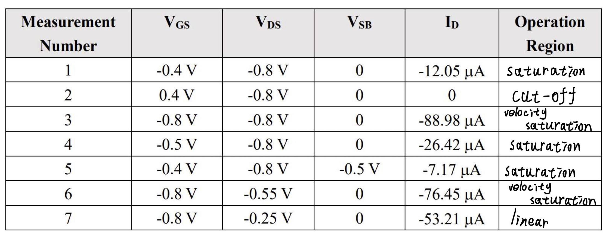

# 1.


# 2. 
### a) 
For short channel device, because carriers scatter off atoms in silicon lattice.
Consider nonlinear velocity model
$$
\begin{cases}
\begin{align}
v_{eff}&=\frac{\mu_{eff}\cdot E}{1+E/E_C},\quad for\ E\le E_C\\
v_{eff}&=v_{sat}=\frac{\mu_{eff}\cdot E_C}{2},\quad for\ E\ge E_C
\end{align}
\end{cases}
$$
By using the formula, we divide four regions of operation:
(1)cut off, (2)linear, **(3)velocity sat**, (4) current sat
Before considering velocity saturation, Drain current is 
$$
I_{DS}={\mu_{eff}C_{ox}}\cdot \frac{W}{L}\cdot[(V_{GS}-V_t)V_{DS}-\frac{V^2_{DS}}{2}]
$$
$$
I_{DS}\propto v
$$
If we replace $v$ with $v_{eff}=\frac{\mu_{eff}\cdot E}{1+E/E_C}\cdot v$ ,in linear region, we have
$$
I_{DS}=\frac{\mu_{eff}C_{ox}}{1+\frac{V_{DS}}{E_CL}}\cdot \frac{W}{L}\cdot[(V_{GS}-V_t)V_{DS}-\frac{V^2_{DS}}{2}]
$$
In velocity saturation region, consider
$$
I_{D}
=WQ_{inv}(y)v(y)$$
we have
$$
\begin{align}
I_{DSAT}&=v_{sat}\cdot C_{ox}\cdot W\cdot [V_{GS}-V_t-V'_{DSAT}]\\
&=\frac{\mu_{eff}C_{ox}}{1+\frac{V_{DS}}{E_CL}}\cdot \frac{W}{L}\cdot[(V_{GS}-V_t)V’_{DSAT}-]\frac{V^{,2}_{DSAT}}{2}]\\
&=\frac{\mu_{eff}E_c}{2}\cdot C_{ox}\cdot W\cdot[V_{GS}-V_t-V'_{SAT}]
\end{align}
$$
where
$$
V'_{DSAT}=\frac{V_{GS}-V_T}{1+(V_{GS}-V_T)/E_C\cdot L}=K\cdot V_{GT}\lt V_{DSAT}
$$

### b)
Drain current function for long-channel devices
$$
\begin{align}
I_{DS}&=\mu C_{ox} \frac{W}{L}(V_{GS}-V_T-\frac{V_{DS}}{2})V_{DS}\\
I_{DSAT}&=\mu C_{ox} \frac{W}{L}\frac{(V_{GS}-V_T)^2}{2}
\end{align}
$$
Drain current function for short-channel devices
$$
\begin{align}
I_{DSAT}&=v_{sat}\cdot C_{ox}\cdot W\cdot [V_{GS}-V_t-V'_{DSAT}]\\
&=\frac{\mu_{eff}C_{ox}}{1+\frac{V_{DS}}{E_CL}}\cdot \frac{W}{L}\cdot[(V_{GS}-V_t)V’_{DSAT}-]\frac{V^{,2}_{DSAT}}{2}]\\
&=\frac{\mu_{eff}E_c}{2}\cdot C_{ox}\cdot W\cdot[V_{GS}-V_t-V'_{SAT}]
\end{align}
$$
As we know $E=\frac{V}{L}$, so compared with long-channel devices, electric field increasing faster with voltage improving in short-channel devices. As a result, for short-channel devices, it's easier to reach velocity saturation.

According to both above functions, we can find: when reaching saturation region, $\frac{I_{D}}{V_{GS}}$ is going to follow qquadratic relation for long-channel devices, meanwhile linear relation for short-channel devices.

# 3.  
Calculated by Matlab
```matlab
clear all;

V_GS=[2.5 2 2 2 2];

V_DS=[1.8 1.8 2.5 1.8 1.8];

V_BS=[0 0 0 -1 -2];

V_SB=-V_BS;

I_D=[1812 1297 1361 1146 1039]*1e-6;

V_DSAT=0.6;

k=100e-6;

format short;

syms x y;

% calculate V_T0

% V_T1=solve((V_GS(1)-x-V_DS(1)/2)/(V_GS(2)-x-V_DS(2)/2)==(I_D(1))/(I_D(2)),x)%linear region

% V_T2=solve((V_GS(1)-x)^2/(V_GS(2)-x)^2==(I_D(1))/(I_D(2)),x)%saturation region

V_T3=solve((V_GS(1)-x-V_DSAT/2)/(V_GS(2)-x-V_DSAT/2)==(I_D(1))/(I_D(2)),x);%velocity saturation region

V_T0=V_T3

% To calculate Lambda, consider CLM

Lambda = solve((1 + x*V_DS(2)) / (1 + x*V_DS(3)) - (I_D(2)) / (I_D(3)) == 0,x)

% To calculate Gamma and Phi_S(2*Phi_F), consider body effect

V_T1=solve((V_GS(2)-V_T0-V_DSAT)/(V_GS(4)-x-V_DSAT)-(I_D(2))/(I_D(4))==0,x);

V_T2=solve((V_GS(2)-V_T0-V_DSAT)/(V_GS(5)-x-V_DSAT)-(I_D(2))/(I_D(5))==0,x);

eqn1 = V_T1 == V_T0 + x*(sqrt(y + V_SB(4))-sqrt(y));

eqn2 = V_T2 == V_T0 + x*(sqrt(y + V_SB(5))-sqrt(y));

[Gamma Phi_S] = solve([eqn1 eqn2],[x y])

% calculate W/L

rel=solve(I_D(1) == x*k*(V_GS(1)-V_T0-V_DSAT/2)*V_DSAT*(1+Lambda*V_DS(1)),x)
```

Firstly, consider data1 and data2, due to $V_{DS1}$ and $V_{DS2}$, it works in saturation region,  so we have
$$
\frac{V_{GS1}-V_{T0}-\frac{V_{DSAT}}{2}}{V_{GS2}-V_{T0}-\frac{V_{DSAT}}{2}}=\frac{I_{D1}}{I_{D2}}
$$
After calculating, we find $V_{T0}=0.4408\ V$.

To calculate $\lambda$, consider data2 and data3, we have
$$
\frac{1+\lambda V_{DS2}}{1+\lambda V_{DS3}}=\frac{I_{DS2}}{I_{DS3}}
$$

After calculating, we find $\lambda=0.0807$.

To calculate $\gamma$ and $\Phi_S$, consider data4 and data5, we have
$$
\begin{cases}
\frac{I_{D2}}{I_{D4}}=\frac{V_{GS2}-V_{T0}-V_{DSAT}}{V_{GS4}-V_{T4}-V_{DSAT}}\\\\
\frac{I_{D2}}{I_{D5}}=\frac{V_{GS2}-V_{T0}-V_{DSAT}}{V_{GS5}-V_{T5}-V_{DSAT}}\\
\end{cases}
\Rightarrow
\begin{cases}
V_{T4}=0.5525\ V=V_{T0}+\gamma (\sqrt{\Phi_S+V_{SB4}}-\sqrt{\Phi_S})\\\\
V_{T5}=0.6316\ V=V_{T0}+\gamma (\sqrt{\Phi_S+V_{SB5}}-\sqrt{\Phi_S})
\end{cases}
$$
So we have $\gamma =0.2276$ and $\Phi_S=0.5989$

To Calculate $\frac{W}{L}$, consider data1
$$
I_{D1}=\frac{W}{L}K'(V_{GS1}-V_{T}-\frac{V_{DSAT}}{2})V_{DSAT}(1+\lambda V_{DS1})
$$
So we have $\frac{W}{L}=14.9885\approx 15$

# 4.
### a)
Compare data1 and data2, it's easy to find MOSFET cutoff when $V_GS \gt 0$ and is enabled when $V_{GS}\lt 0$, which means $V_T0 \lt 0$. Thus this MOSFET is PMOS.

### b)

Calculated by Matlab
```matlab
clear all;

format short

% PMOS

V_GS = [-0.4 0.4 -0.8 -0.5 -0.4 -0.8 -0.8];

% V_SG = -V_GS;

V_DS = [-0.8 -0.8 -0.8 -0.8 -0.8 -0.55 -0.25];

V_SD = -V_DS;

V_SB = [0 0 0 0 -0.5 0 0];

% V_BS = -V_SB;

I_D = [-12.05 0 -88.98 -26.42 -7.17 -76.45 -53.21];

V_DSAT = -0.4;

Phi_S = 0.6;

syms x y

% Calculate V_T0

V_T=solve(((V_GS(1)-x)^2) / ((V_GS(4)-x)^2) == (I_D(1)) / (I_D(4)),x);

V_T0=V_T(2)

% Calculate Gamma

% V_T1=solve((V_GS(1)-V_T0-V_DSAT)/(V_GS(5)-x-V_DSAT)-(I_D(1))/(I_D(5))==0,x);

V_T5=solve(((V_GS(1)-V_T0)^2) / ((V_GS(5)-x)^2) - (I_D(1)) / (I_D(5)) == 0,x);

eqn1 = + V_T0 + x*(sqrt(Phi_S+V_SB(5))-sqrt(Phi_S)) == V_T5(2);

Gamma = solve(eqn1,x)

% Calculate Lambda

Lambda = solve((1+x*V_DS(3)) / (1+x*V_DS(6)) == (I_D(3)) / (I_D(6)) ,x)

```

To calculate $V_{T0}$, consider data1 and data4, because $V_{DS}\lt V_{GS}$ , so it works in velocity region or cutoff(sub-threshold). if we negalect sub-threshold region,we can assume it works in velocity region.
$$
\frac{I_{D1}}{I_{D4}}=\frac{(V_{GS1}-V_T)^2}{(V_{GS4}-V_T)^2}
$$
$$
V_T=-0.1920\ V
$$
To calculate $\gamma$, consider data1 and data5
$$
\frac{I_{DS1}}{I_{DS5}}=\frac{(V_{GS1}-V_{T0}^2)}{(V_{GS5}-V_{T5})^2}\Rightarrow V_{T5}=-0.2395\ V
$$
$$
V_{T5}=V_{T0}+\gamma(\sqrt{\Phi_S+V_{SB5}}-\sqrt{\Phi_S})\Rightarrow \gamma = 0.1038
$$
To calculate $\lambda$, consider data3 and data6
$$
\frac{1+\lambda V_{DS3}}{1+\lambda V_{DS6}}=\frac{I_{DS3}}{I_{DS6}}
$$
$$
\lambda =  -1.0253
$$
### c)
From the above result, by comparing $V_{GT}$ and $V_{DSAT}$, $V_{GT}$ and $V_{DS}$ we can find operation region of every group. 

# 5.
### a)
$$
C_{ox}=\frac{\varepsilon_{ox}}{t_{ox}}
$$
$$
t_{ox}=\frac{\varepsilon_{ox}}{C_{ox}}=233.33\ \mu m
$$
### b)
$$
C_{GC}=W\cdot L_{eff}\cdot C_{ox}=0.806\ \mathrm fF
$$
$$
C_{GS}=C_o\cdot W=0.130\ \mathrm fF
$$
### C)
$$
C_{GC}=\frac{2}{3}C_{ox}\cdot W\cdot L_{eff}=0.576\ \mathrm fF
$$
$$
C_{GS}=C_o\cdot W=0.120\ \mathrm fF
$$
# 6.
### a)
Because grid and drain are shorted, so working in cutoff region, velocity saturation and saturation are possible for the device.
### b)
1. cut-off
$$

V_{GT}=V_{dd}-V_o-V_T\lt 0\\
$$$$
V_o\gt V_{dd}-V_T
$$
2. velocity saturation
$$
\begin{cases}
V_{GT}=V_{dd}-V_o-V_T\ge 0\\
V_{DS}=V_{dd}-V_T\ge V_{dsat}'
\end{cases}
$$
which is 
$$
\begin{cases}
V_o\le V_{dd}-V_T\\
V_o\le V_{dd}-V_{dsat}'
\end{cases}
$$
$$
V_o\le min(V_{dd}-V_T,\ V_{dd}-V_{dsat}')
$$
3. saturation
$$
\begin{cases}
V_{GT}=V_{dd}-V_o-V_T\ge 0\\
V_{DS}=V_{dd}-V_T\le V_{dsat}'
\end{cases}
$$
$$
V_{dd}-V_{dsat}'\lt V_o\le V_{dd}-V_T

$$
# 7.
### a)
Assume it works in linear region
$$
I=K'\frac{W}{L}(V_o-V_i-V_T-\frac{VDD-V_o}{2})(VDD-V_o)
$$
$$
Vi=-V_T+V_o-\frac{VDD-V_o}{2}-\frac{IL}{K'W(VDD-V_o)}
$$
Apparently, it's not linear relation, so assume it works in saturation region
$$
I=K'\frac{W}{L}\frac{(V_i-V_o-V_T)^2}{2}
$$
$$
V_i=\sqrt{\frac{2IL}{K'W}}+V_o+V_T
$$
So the shift level is 
$$
\Delta V=\sqrt{\frac{2IL}{K'W}}+V_T
$$
### b)
$$
\begin{align}
V_T&=V_{T0}+\gamma (\sqrt{\Phi_S+V_o}-\sqrt{\Phi_S})\\
&=0.43+0.4(\sqrt{0.6+V_o}-\sqrt{0.6})
\end{align}
$$

### c)


With body effect improving, shift level of the source-follower increasing, which means $\Delta V$ increasing
$$
|\Delta V_i|=0.2698\ V
$$
# 8.
### a)
$$
\begin{align}
I_{dsat}&=\frac{\mu_0 C_{ox}}{2}\frac{W}{L}(V_{GS}-V_T)^2\\
&=\frac{\mu_0 C_{ox}}{2}\frac{W}{L}(V_{GS'}-V_T)^2\frac{1}{1+\frac{V_{GS}-V_T}{E_{sat}\cdot L}}\\
&=\frac{\mu_0 C_{ox}}{2}\frac{W}{L}(V_{GS}-V_T-I_D R_S)^2\\
&=\frac{\mu_0 C_{ox}}{2}\frac{W}{L}[(V_{GS}-V_T)^2+I_D^2 R_S^2-2(V_{GS}-V_T)I_D R_S]
\end{align}\\
$$
Because the voltage drops across $R_S$ is typically small, so we ignore  quadratic term, that is
$$\begin{align}
\frac{\mu_0 C_{ox}}{2}\frac{W}{L}[(V_{GS}-V_T)^2&-2(V_{GS}-V_T)I_D R_S] \\&=\frac{\mu_0 C_{ox}}{2}\frac{W}{L}(V_{GS}-V_T)^2
\end{align}$$

$$
R_S=\frac{L}{W}\cdot\frac{1}{E_{sat}\cdot L\cdot \mu_0 C_{ox}}=\frac{1}{WE_{sat}\mu_0 C_{ox}}=
$$
### b)
$$
R_S=\frac{1}{WE_{sat}\mu_0 C_{ox}}=\frac{1}{WE_{sat}K'}=\frac{1}{30W}\Omega\cdot m
$$
Value of the resistance is independant of channel length but channel width.


